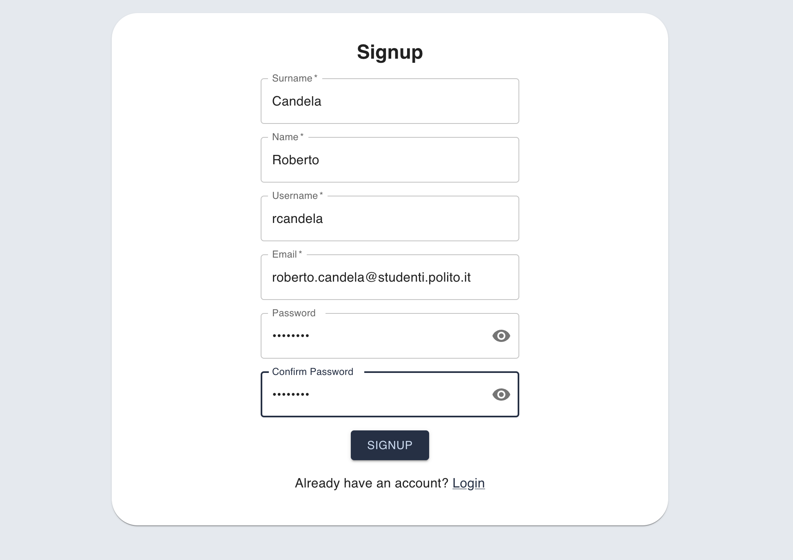
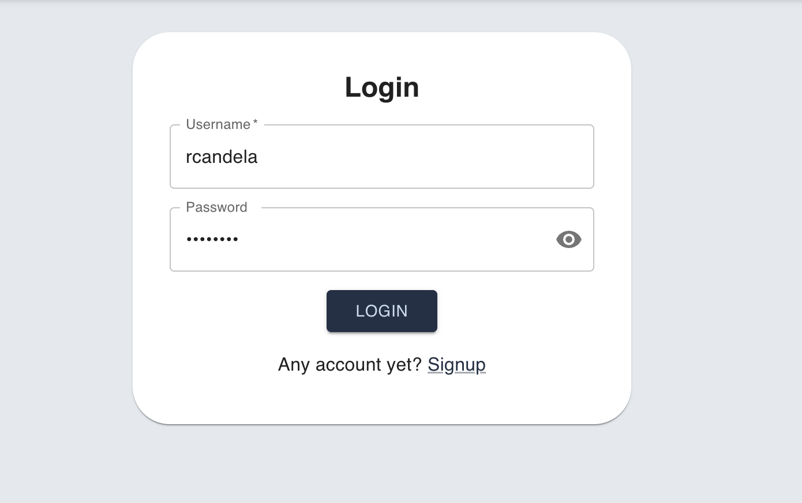
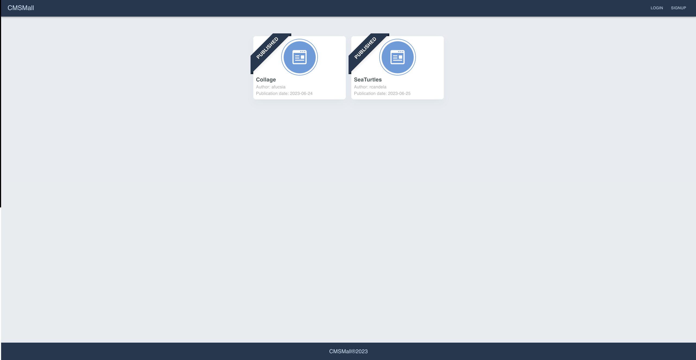
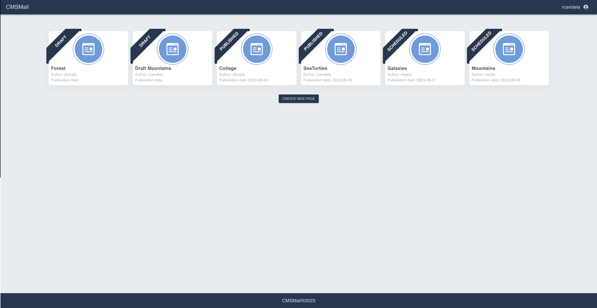
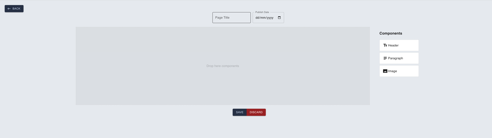
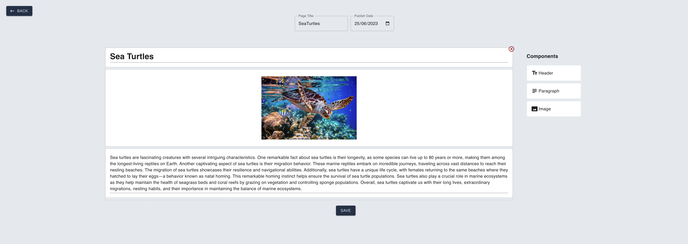
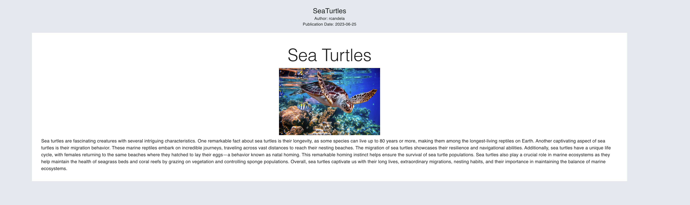

# Exam #s318917: "CMSmall"

## Student: s318917 CANDELA ROBERTO

# Server side

## API Server

### User API

#### Get All Users

- Endpoint: `GET /api/users`
- Description: Retrieves a list of all users.
- Response Format: JSON
- Response Code:
  - 200 OK: Successful operation
  - 500 Internal Server Error: An error occurred while retrieving the users

#### Create User

- Endpoint: `POST /api/users`
- Description: Creates a new user.
- Request Format: JSON
- Request Body:
  - `name`: String (1-50 characters, required)
  - `surname`: String (1-50 characters, required)
  - `username`: String (1-20 characters, required)
  - `email`: String (valid email format, required)
  - `password`: String (strong password, required) see the paragraph dedicated to isStrongPassword() from express-validator
- Response Format: JSON
- Response Code:
  - 201 Created: User created successfully
  - 400 Bad Request: Invalid request body
  - 422 Unprocessable Entity: Validation error
  - 500 Internal Server Error: An error occurred while creating the user

#### Get User by ID

- Endpoint: `GET /api/users/:id`
- Description: Retrieves a user by ID.
- Parameters:
  - `id`: User ID
- Response Format: JSON
- Response Code:
  - 200 OK: Successful operation
  - 404 Not Found: User with id `:id` not found
  - 500 Internal Server Error: An error occurred while retrieving the user

#### Delete User

- Endpoint: `DELETE /api/users/:id`
- Description: Deletes a user by ID.
- Parameters:
  - `id`: User ID
- Response Code:
  - 204 No Content: User deleted successfully
  - 500 Internal Server Error: An error occurred while deleting the user

### Session API

#### Create Session

- Endpoint: `POST /api/sessions`
- Description: Creates a new session for user authentication.
- Request Format: JSON
- Request Body:
  - `username`: String (1-20 characters, required)
  - `password`: String (strong password, required)
- Response Format: JSON
- Response Code:
  - 200 OK: Session created successfully
  - 400 Bad Request: Invalid request body
  - 401 Unauthorized: Invalid credentials
  - 500 Internal Server Error: An error occurred while creating the session

#### Get Current Session

- Endpoint: `GET /api/sessions/current`
- Description: Retrieves the details of the current session.
- Response Format: JSON
- Response Code:
  - 200 OK: Successful operation
  - 401 Unauthorized: No active session
  - 500 Internal Server Error: An error occurred while retrieving the session

#### Delete Session

- Endpoint: `DELETE /api/sessions/current`
- Description: Deletes the current session, logging out the user.
- Response Code:
  - 204 No Content: Session deleted successfully
  - 401 Unauthorized: No active session
  - 500 Internal Server Error: An error occurred while deleting the session

### Page API

#### Get All Pages

- Endpoint: `GET /api/pages`
- Description: Retrieves a list of all pages.
- Response Format: JSON
- Response Code:
  - 200 OK: Successful operation
  - 500 Internal Server Error: An error occurred while retrieving the pages

#### Get Page by ID

- Endpoint: `GET /api/pages/:id`

## Database Tables

### Table: users

This table stores information about the users of the application.

| Column   | Type         | Constraints |
| -------- | ------------ | ----------- |
| id       | varchar(36)  | PRIMARY KEY |
| name     | varchar(50)  | NOT NULL    |
| surname  | varchar(50)  | NOT NULL    |
| username | varchar(20)  | NOT NULL    |
| email    | varchar(20)  | NOT NULL    |
| password | varchar(64)  | NOT NULL    |
| salt     | varchar(100) | NOT NULL    |
| isAdmin  | integer      | DEFAULT 0   |

### Table: blocks

This table stores information about the blocks used in the application.

| Column      | Type          | Constraints          |
| ----------- | ------------- | -------------------- |
| id          | varchar(36)   | PRIMARY KEY          |
| blockType   | varchar(50)   | NOT NULL             |
| content     | varchar(200)  | NOT NULL             |
| page_blocks | varchar(16)   | NOT NULL             |
| item_order  | integer       |                      |
| FOREIGN KEY | (page_blocks) | REFERENCES pages(id) |

### Table: pages

This table stores information about the pages in the application.

| Column           | Type        | Constraints          |
| ---------------- | ----------- | -------------------- |
| id               | varchar(36) | PRIMARY KEY          |
| title            | varchar(50) | NOT NULL             |
| author           | varchar(50) | NOT NULL             |
| created_at       | TEXT        |                      |
| publication_date | TEXT        |                      |
| FOREIGN KEY      | (author)    | REFERENCES users(id) |

### Table: settings

This table stores general settings for the application.

| Column | Type        | Constraints |
| ------ | ----------- | ----------- |
| id     | varchar(10) | PRIMARY KEY |
| value  | varchar(10) | NOT NULL    |

# Client side

## React Client Application Routes

### Route Descriptions

- `/`: The root route renders the `Home` component, passing the `loggedIn` props. This is the home for the application.

- `/login`: This route renders the `Login` component if the user is not logged in. If the user is already logged in, they are redirected to the root route ("/").

- `/signup`: This route renders the `Signup` component if the user is not logged in. If the user is already logged in, they are redirected to the root route ("/").

- `/modifyPage/:id`: This route renders the `ModifyPage` component if the user is logged in.

- `/page/:id`: This route renders the `Page` component.

- `/page/new`: This route renders the `NewPage` component if the user is logged in.

- `/settings`: This route renders the `Settings` component if the user is logged in and is an admin. Otherwise, the user is redirected to the login route ("/login").

- `*`: This route renders the `NoMatch` component for any other paths that do not match the above routes.

## Main React Components

- `Canvas` (in `canvas.jsx`): This component is responsible for rendering a draggable canvas where users can create and modify content blocks. It allows users to drag and drop components such as headers, paragraphs, and images onto the canvas. Users can also edit the content of each block and rearrange their order.
- `PageCard` (in `page-card.jsx`): This component is used to display a card representing a page. It shows the page title, author, and publication date. Authorized users can edit or delete the page. The card includes a ribbon indicating the publication status and shows edit and delete icons when hovered over
- `ComboBox`(in `combobox.jsx`):
  The ComboBox component renders a dropdown menu with autocomplete functionality for selecting and assigning users. It retrieves a list of users from a service, transforms the data, and populates the dropdown options. When a user is selected, the assignedUser state is updated
- `Layout`(in `layout.jsx`): The Layout provides a structure for the user interface. It includes a navigation bar, content area, and footer. The navigation bar displays the application name, login/signup buttons (if the user is not logged in), and user-related options (such as username and logout) when the user is logged in. The content area is a placeholder where the content of the currently matched route is rendered using the Outlet component from React Router.

# Usage info

## Signup

## Login

## Home with no logged user

## Home with logged user

## Create new page

## Edit existing page

## Page render

## Users Credentials
The passwords are the same for each user. Not the best security practice, but useful for debug purpose!

- admin, admin
- rcandela, Aa12345! (draft,published page)
- rmario, Aa12345! (scheduled page)
- lverde, Aa12345! (scheduled page)
- afucsia, Aa12345! (published,draft page)
- sgiallo, Aa12345! (no page created)

## isStrongPassword()

Minimum length: The password must be at least 8 characters long.
At least one uppercase character: The password must contain at least one uppercase letter.
At least one lowercase character: The password must contain at least one lowercase letter.
At least one number: The password must contain at least one number.
At least one special character: The password must contain at least one special character such as !@#$%^&\*()\_+-=[]{}|:;<>,.?/~.
